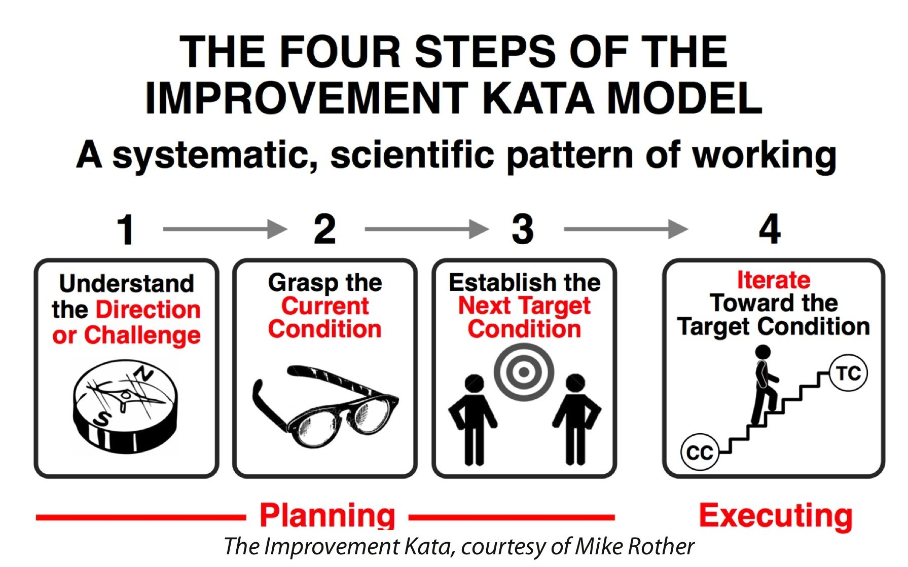
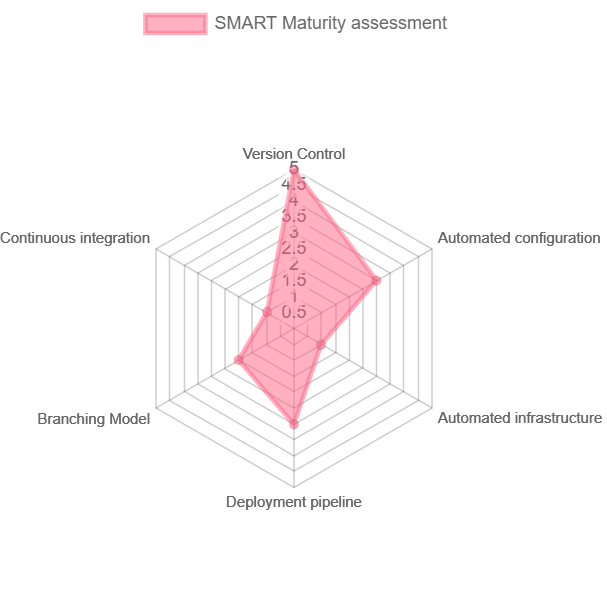

# SMART DevOps Maturity assessment

Last year I was tasked with creating a roadmap to improve further the DevOps Agile Maturity of our product development teams. I needed to assess how far we went in our transformation journey and decide what more to accomplish. Therefore I needed a tool or methodology to perform the evaluation and gather feedback from everyone.

With my Industrial Engineering background, I decided to repurpose a Lean Manufacturing methodology that should enable me to complete the task. Lean Six Sigma practitioners have been working on a toolbox to evaluate the adoption of their practices for the past three decades. Without a dought some lessons to learn from that.

This article aims to revisit the methodology called `SMART Readiness Maturity Assessment` to create a similar tool that would facilitate tracking a company or team's progress through their digital transformation journey and adoption of DevOps culture. I will walk you through the step that would lead you to evaluate your organization's maturity and create a road map to advance further in your journey.

The exercise I propose follows the Improvement Kata Model. `SMART Readiness Maturity Assessment` is just a tool you will use in your Kata's planning phase (see illustration below). As the person you lead the transformation, your mindset should be the following:

* First, we identify core practices in the establishment of the DevOps methodology. This should help us understand the direction or challenges that need to be taken into consideration.
* Second, we provide a methodology (SMART) to grasp the current situation and establish the following targets that would best benefit the company but improving its maturity in some of the core practices.

> A kata is a pattern you practice to learn a skill and mindset. Through practice, a kata pattern becomes second nature - done with little conscious attention - and readily available. Examples are riding a bicycle, driving a car, typing. People who have learned to drive don't think much about using the car's controls. They focus on navigating the road ahead. [Reference](https://www.lean.org/Workshops/WorkshopDescription.cfm?WorkshopId=68)

## What is the SMART Maturity assessment?

The manufacturing world was facing the challenge of creating a "satisfactory and ongoing trajectory towards an effective application of Lean principles". Consequently, a novel Maturity Model and assessment tool called SMART has been developed as part of a Lean Transformation Toolkit (Lean T2) within the LeanPPD project funded by the European Commission (NMP-2008-214090).

SMART is an acronym for the five levels of maturity used in the methodology: **S**tart, **M**otivate, **A**pply, **R**eview, **T**ransform.

Maturity levels of the SMART Maturity Model and assessment tool adapted to DevOps practices: 
* Level 1 (**S**tart): The organization does not implement DevOps practices in its product development. 
* Level 2 (**M**otivate): The organization is aware of the DevOps practices and is starting to implement them. 
* Level 3 (**A**pply): The organization is applying DevOps practices in its product and process development and has achieved a basic implementation level. 
* Level 4 (**R**eview and Improve): The company is applying DevOps practices in its product and process development and continuously measures its results to implement improvement actions. 
* Level 5 (**T**ransform): The organization applies DevOps best practices and shares them internally and externally along the complete value chain.

The result of the evaluation can be easily represented as a [Radar Chart](https://chachart.net/radar?lang=en). With time and effort, you should see the area covered in the diagram grow. It is a great way to keep track of your progressions over time.

## When should you use SMART?

I recommend using this evaluation if you have been working on your digital transformation for at least a year. SMART is not adequate for an initial assessment that should trigger the journey. At least in the implementation, I proposed.

If you are looking for an initial evaluation, there are better models you can find. They should offer you a set of specific questions to answer and a list of actions or directions to start with, leading to a better understanding of the DevOps culture.

The way I see this, this version is more like a retrospective exercise at the organization level that provides not only an evaluation but also specific insight proper to your business that you can work to improve. This is in the spirit of the Improvement Kata Model.

## Which practices to evaluate with SMART

The original SMART tool in the Lean T2 toolkit evaluates 14 lean practices under four perspectives. Thus, the assessment integrates the results of 56 qualitative Lean approaches. (the four perspective being: 1) Time, Cost, and Quality Measurement 2) New Product Development Process 3). Tools  4)  Skilled People)

Similarly, we can identify any number of practices in the DevOps world to feed our SMART tool. Steve Smith introduces in his talk 15 techniques involved in the transformation of continuous delivery that I took as a reference in my first implementation of SMART. I personally drop the four perspectives that I did not judge relevant in my context and would make the evaluation process heavier. this is the list of items I have evaluated: 

* Version Control
* Automated configuration
* Automated infrastructure
* Deployment pipeline
* Branching Model
* Continuous integration
* Evolutionary architecture
* database migration
* test-driven development
* Acceptance Tests
* Smoke Test
* Exploratory Testing
* Non-functional test
* Dynamic test data
* Monitoring and alerting
* Canary deployment and Feature Toggling

## How to performe the assessement

As the evaluator (i.e. DevOps evangelist), it is not your role to tell teams their maturity level. It would be best if you aimed to increase adoption and ease the change management process. Still, you need to lead the improvement Kata, meaning that you are an observer that will organize interviews and workshops to grasp the current situation. You are accompanying everyone like a gentle wind pushing the boat in the right direction. Proceeding that way will better include your colleges in the journey.

### Step 1: Team Lead and Product Owner Interviews

In the first phase, gathering an initial feed back is essential it is the catalyst for improving people's mind set and empowering with new techiniques. **Tech lead** most likely already have an opinion on the improvements they would like to implement. On ther oter hand **Product Owners** need to be aware of the best practices in terms of product development. They also need to understand why they should dedicate some development time to improve some technical aspects. They need to understand the business value of the proposed practices in the product development cycle.

This is your chance to bring the business, the technologies and the operation on the same page.

During the interview:

* Explain what `SMART Maturity assessment` is.
* Review each of the 15 items and try to place them in each of the maturity levels (1 to 5)
* Each time, open the conversation to gain as much insight as possible. And remember the planning step of the Improvement Kata model:
   * Understand the direction or change - For instance ask: What is Canary deployment? What is the value of it? 
   * Grasp the current situation - For example: What do we do concerning Version control? What can we improve? Is there a blocker that stops us from implementing improvements? Do we need to do more research on the topic to understand the best practices on the market?
   * Establish the following target condition - Do we have interest in getting better on that item? Do we have a use case for it? Do we have a project that would immediatly benefit from it?

> Don't be afraid of admitting that you are at a maturity level 1 (Start). 

### Step 2: Team retrospective

This exercise will help us gather feedback from everyone and have a more accurate evaluation of the maturity. You tech lead opinions may not reflect the team buy-in for some practices, or the knowledge among teams or across team may be heterogeneous. The more people you involve in the process, the more accurate your evaluation will be.

I organized this exercise as a retrospective exercise. An excellent way to introduce the activity would be to highjack one of the retrospectives for each team. So get your post-it ready! (or a miro board during Covid time).

> You do not need to introduce SMART yet. The exercise below approach the assessment in a different angle to gather the maximum number of insight

1. Create 3 cards or post-its for each of the 15 items. So 45 cards in total, we want to duplicate so several team members can express themself on each topic.

Based on the previous step, do not hesitate to remove an item you identified as level 1. Those items may create confusion among you team member, and they will not provide meaningful insight.

2. Distribute your deck of card so that everyone has 3 to 4 cards. Giving more cards would result in a more prolonged exercise. You can count on the fact that there is a duplication of each card and that you will repeat the exercise with several teams to converge to a clear picture of the situation.

3. Ask people to write comments on a post-it for each of the items they have been given following those rules:
* You need to write at least 3 post-it per card
* You must write positive feedback on green post-it
* You must write negative feedback on red post-it
* If you know very little about the card you can write a single post-it that says that you don't know anything about-it or that you know that we did not implement anything yet.

> Set a 10 min timer for people to create the post-its

4. In turn ask each team member to stick its post-it on the board following those rules and comment about it:
* If you wrote mostly red post-it (negative feedback) place it next to the caol
* If you wrote mostly green post-it (positive feedback) place it next to the diamand
* Otherwise place them in the middle

5. Once everyone place its post-it you can wrappe up the exercise by creating the Radar chart.

* Coal count as level 1
* Diamon count as leve 3
* Everything else count as level 2

You can now explain what is `SMART Maturity assessment` and tell them what you will do with all their insight (keep reading, so I tell You what to do with all the post-it collected). 

### Step 3: Compiling the results

Create a table in your favorite tool (Confluance, Excel, or others). Compile the maturity score for the interview and retrospective exercice. Create an average score accross your organisation, this is your maturity level from wich you will create the final Radar Chart. Report and compile all the insight collected alongside the `SMART Maturity assessment` score. They will be usefull to create your road map.

> Why do we score items between 1 and 3 in the *Step 2* execise and not between 1 and 5?

As it is the first time you do the exercise we can assume that you did not yet review any process. Remember that to reach level 4 you need to continuously measures results to implement improvement actions. It may be the case and if some member mentionned in there post-it that you have KPI ready for that item then go ahead your earn your level 4 maturity level for that item (Congratulation). 

### Step 4: Deciding on a road map

Creating the road map base on SMART is simply to ask: How do I want my Radar Chart in a year from now?

the levers to achieve and sustain changes are based on the maturity level:
* Moving from **S**tart to **M**otivated involves making presentation, creating workshop to promote best practices associated with an item. It could also mean encourage professional training, conferences, or seaching for specific skills in future recrutement.
* Moving from **M**otivated to **A**pplied requires to some Epic or stories to implement changes.
* Moving from **A**pplied to **R**eviewed forces you to implement KPIs, document the process, dedicate time to continously review the tols in place.
* Moving from **R**eviewed to **T**ransformed symbolises that you have established a "Bible" of how you do X in company Y. 

## Final thought

## References:

* [DevOps Maturity Model – From Traditional IT to Complete DevOps](https://www.veritis.com/blog/meet-full-devops-potential-with-devops-maturity-model/#:~:text=By%20definition%2C%20DevOps%20Maturity%20is,crucial%20to%20achieving%20DevOps%20maturity.)
* [BENEFITS OF SMART MATURITY ASSESSMENT](https://lean-analytics.org/smart-maturity-assessment/)